<picture>
  <source media="(prefers-color-scheme: dark)" srcset="./assets/banner-dark-v2.svg" />
  <source media="(prefers-color-scheme: light)" srcset="./assets/banner-light-v2.svg" />
  
</picture>

  

I build AI systems that hold up under pressure: **LLM red-teaming, RAG, and serverless backends.**

Started writing Lua in Roblox as a kid. Still shipping. CS @ University of Toledo.

---

## 🚀 Featured Projects

* **[Roqer](https://github.com/S4US/Roqer): Open-Source AI Agent for Roblox Studio** *(collaborator & contributor)* 
  An AI agent that builds, scripts, and playtests inside Roblox Studio using your own ChatGPT/Claude subscription or API key. I build the Rojo integration: linking Rojo projects from the app and syncing script edits back to the project's files. The kid who wrote Roblox Lua, now building the AI that writes it.

* **[Redline](https://github.com/avneetxsingh/Redline): Adversarial LLM Testing Framework**
  Adaptive red-teaming engine that picks from 13 attack strategies based on how the model responds, with LLM-as-judge scoring across 5 providers running concurrently via asyncio. Hit a **60% breach rate vs. 25% for static attacks** under identical conditions. FastAPI + WebSocket live dashboard.

* **[Undertone](https://github.com/avneetxsingh/undertone): Real-Time Audio-Intelligence Platform**
  AI meeting assistant in Next.js and TypeScript with cross-session RAG memory, so suggestions pull context from past meetings with dates cited. Multi-tenant AWS backend built with CDK, Lambda, API Gateway, DynamoDB, S3 Vectors, SQS, and KMS, with account-isolated data access and **153 automated tests**.

* **[Docling](https://github.com/avneetxsingh/Docling): RAG Research Copilot**
  Upload PDFs, get source-grounded answers. Self-hosted embeddings, MMR retrieval over FAISS, Groq generation, and token streaming over SSE. Dockerized FastAPI on Railway, React on Vercel, with a factory layer to swap FAISS for Pinecone.

---

## 📦 Recently Shipped
<!-- RECENT:START -->
* `Oct 8, 2026` · [Link a Rojo project from the Roqer app, and remember it for published places](https://github.com/S4US/Roqer/pull/70) in [S4US/Roqer](https://github.com/S4US/Roqer)
* `Oct 8, 2026` · [Save script edits on Rojo-linked places to the project's files](https://github.com/S4US/Roqer/pull/66) in [S4US/Roqer](https://github.com/S4US/Roqer)
* `Jul 18, 2026` · [Adaptive experiment local models](https://github.com/avneetxsingh/Redline/pull/3) in [avneetxsingh/Redline](https://github.com/avneetxsingh/Redline)
* `Jul 15, 2026` · [Rescheck v2](https://github.com/avneetxsingh/ResCheck/pull/1) in [avneetxsingh/ResCheck](https://github.com/avneetxsingh/ResCheck)
* `Jun 27, 2026` · [fix: add railway.toml with explicit start command for dashboard backend](https://github.com/avneetxsingh/Redline/pull/2) in [avneetxsingh/Redline](https://github.com/avneetxsingh/Redline)
<!-- RECENT:END -->

Auto-updated every 6 hours from my merged PRs.

---

## 👨‍💻 Tech Stack
<picture>
  <source media="(prefers-color-scheme: dark)" srcset="https://skillicons.dev/icons?i=py,ts,js,fastapi,django,react,nextjs,nodejs,aws,docker,postgres,pytorch,githubactions,linux&theme=dark" />
  <source media="(prefers-color-scheme: light)" srcset="https://skillicons.dev/icons?i=py,ts,js,fastapi,django,react,nextjs,nodejs,aws,docker,postgres,pytorch,githubactions,linux&theme=light" />
  
</picture>

---

## 📘 Publications

7 publications on generative AI, healthcare, and blockchain, in Taylor & Francis, Routledge, Emerald, and IGI Global. 

See all 7

* [*"Transformative Pedagogy: ChatGPT as a Catalyst for Educational Innovation"*](https://www.emerald.com/insight/content/doi/10.1108/978-1-83549-852-120251008/full/html), Book Chapter, **Emerald Publishing** (2025)
* [*"AI in Healthcare"*](https://www.researchgate.net/publication/390938155_AI_in_Healthcare), Book Chapter (2025)
* [*"Empowering Patients in Healthcare Technology: Navigating Privacy, Power, and Ethical Progress"*](https://www.researchgate.net/publication/389754871_Empowering_Patients_in_Healthcare_Technology_Navigating_Privacy_Power_and_Ethical_Progress), Article (2025)
* [*"ChatGPT in Marketing: Innovative Pathways, Decision Systems, and Forward Perspectives"*](https://www.tandfonline.com/doi/full/10.1080/12460125.2024.2438615), Journal Article, **Journal of Decision Systems** (Taylor & Francis) (2024)
* [*"Blockchain and ESG"*](https://www.taylorfrancis.com/chapters/edit/10.4324/9781003378341-2/blockchain-esg-harjit-singh-avneet-singh), Book Chapter, **Routledge** (Taylor & Francis) (2024)
* [*"Transforming Healthcare: The Role of Generative AI in Personalized Treatment Recommendations"*](https://www.researchgate.net/publication/382903901_Transforming_Healthcare_The_Role_of_Generative_AI_in_Personalized_Treatment_Recommendations), Book Chapter, **IGI Global** (2024)
* [*"ChatGPT: Systematic Review, Applications, and Agenda for Multidisciplinary Research"*](https://www.tandfonline.com/doi/abs/10.1080/14765284.2023.2210482), Journal Article, **Journal of Chinese Economic and Business Studies** (Taylor & Francis) (2023)

---

## 🌐 Connect

---

# 📊 GitHub Stats:

  

  

---

### 🐍 Watch it eat my contributions
<picture>
  <source media="(prefers-color-scheme: dark)" srcset="https://raw.githubusercontent.com/avneetxsingh/avneetxsingh/output/github-snake-dark.svg" />
  <source media="(prefers-color-scheme: light)" srcset="https://raw.githubusercontent.com/avneetxsingh/avneetxsingh/output/github-snake.svg" />
  
</picture>

---

🚀 **Always down to talk AI, LLM evals, backend systems, or startups. Reach out!**
